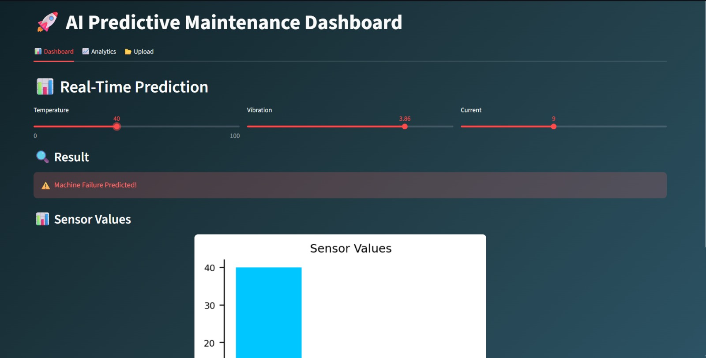
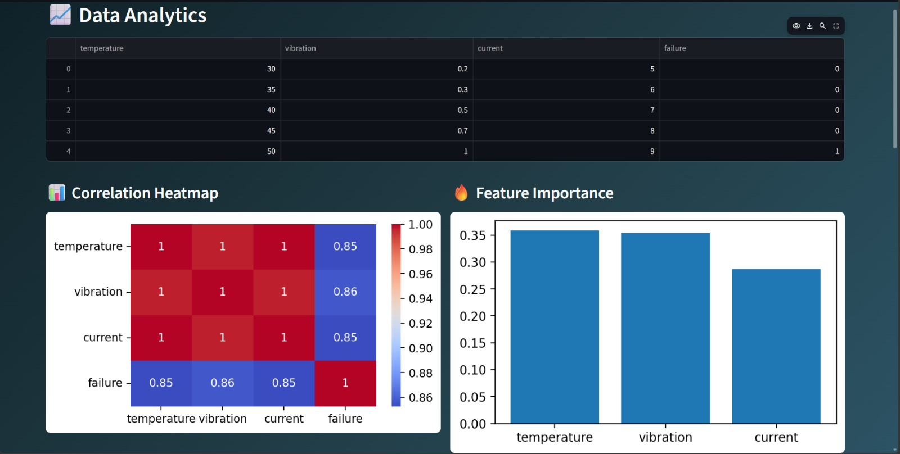
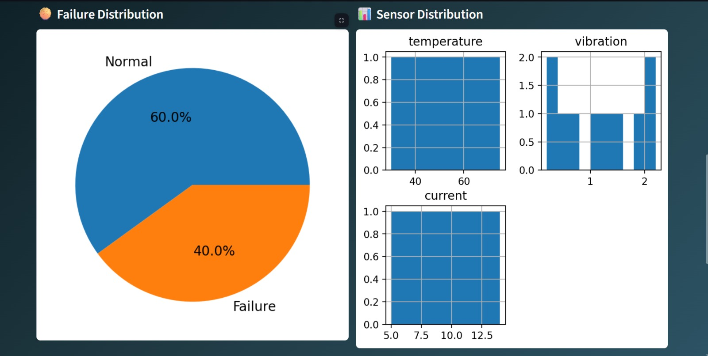
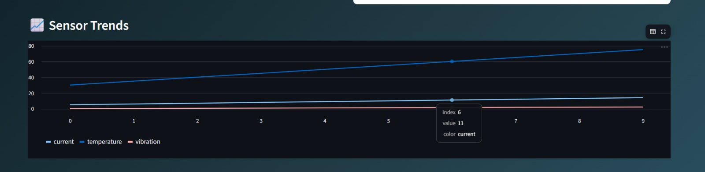
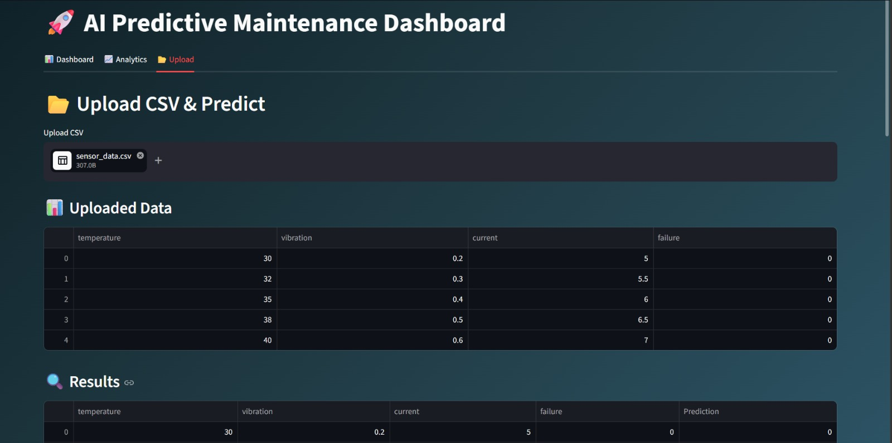
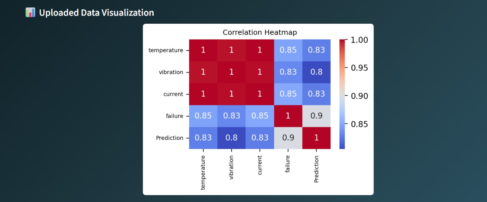

# 🚀 AI Predictive Maintenance Dashboard

An interactive **Machine Learning + Data Analytics dashboard** built using **Python, Streamlit, and Scikit-learn** to predict machine failures based on sensor data.

---

## 📌 📖 Project Overview

This project simulates a **real-world industrial predictive maintenance system** where sensor data such as:

* 🌡️ Temperature
* 🔊 Vibration
* ⚡ Current

are used to **predict machine failure** using a trained Machine Learning model.

It also provides a **modern dashboard interface** for:

* Real-time prediction
* Data visualization
* CSV-based bulk prediction

---

## 🎯 🔥 Key Features

✅ Real-time prediction using sliders

✅ Upload CSV & predict multiple records

✅ Download prediction results

✅ Interactive data visualization

✅ Correlation heatmap

✅ Feature importance graph

✅ Clean and modern UI (Streamlit)

✅ Organized tabs (Dashboard / Analytics / Upload)

---

## 🛠️ 🧠 Tech Stack

* **Python**
  
* **Streamlit** (Frontend Dashboard)
  
* **Scikit-learn** (Machine Learning Model)
  
* **Pandas & NumPy** (Data Processing)
  
* **Matplotlib & Seaborn** (Visualization)
  
* **Joblib** (Model Saving)


## 📂 📁 Project Structure

```
AI-Predictive-Maintenance/
│
├── data/
│   └── sensor_data.csv
│
├── models/
│   └── model.pkl
│
├── src/
│   ├── preprocess.py
│   ├── train.py
│   ├── evaluate.py
│
├── dashboard/
│   └── app.py
│
├── outputs/
│   └── confusion_matrix.png
│
├── requirements.txt
└── README.md
```
---

## ⚙️ 🚀 Installation & Setup

### 1️⃣ Clone Repository

```
git clone https://github.com/sakshimaurya2306-commits/AI-Predictive-Maintenance.git
cd AI-Predictive-Maintenance
```

---

### 2️⃣ Install Dependencies

```
pip install -r requirements.txt
```

---

### 3️⃣ Train Model

```
python src/train.py
```

---

### 4️⃣ Run Dashboard

```
streamlit run dashboard/app.py
```

---

## 📊 📈 Dashboard Sections

### 📊 Dashboard Tab

* Input sensor values manually
* Get instant prediction

### 📈 Analytics Tab

* Correlation heatmap
* Feature importance
* Sensor trends
* Failure distribution

### 📂 Upload Tab

* Upload CSV file
* Bulk prediction
* Download results
* Data visualization

---

## 📄 📥 CSV Format

Make sure your CSV file has the following columns:

```
temperature,vibration,current
```

Example:

```
30,0.2,5
50,1.0,9
```

---

## 🧠 🔍 Machine Learning Model

* Model Used: **Random Forest Classifier**
* Problem Type: **Binary Classification**
* Output:

  * `0 → Normal`
  * `1 → Failure`

---

## 📌 🎯 Use Cases

* Industrial machine monitoring
* Predictive maintenance systems
* IoT-based analytics
* Smart manufacturing

---


## 📸 📷 Screenshots

### 📊 Dashboard

---

### 📈 Analytics








---
### 📂 Upload & Prediction







---

## 🚀 🔮 Future Improvements

* Real-time IoT data integration
* Deep learning models (LSTM)
* Cloud deployment (AWS / Streamlit Cloud)
* Authentication system

---

## 👩‍💻 Author

Sakshi Ramakabal Maurya B.Tech in Information Technology at K.j. Somaiya institute of technology


---

## ⭐ If you like this project

Give it a ⭐ on GitHub and share it!
